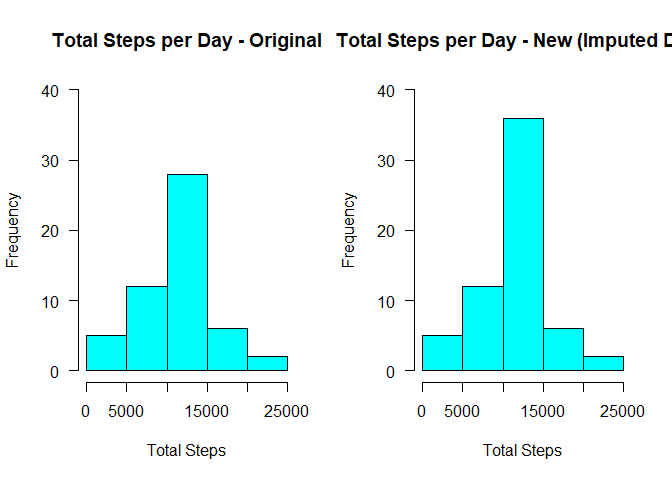

# Reproducible Research: Peer Assessment 1

## Description

This project for the Reproducible Research Class focuses 
on data from a personal activity monitoring device. The dataset is included within the associated GitHub Repository, but also
is [available for download](https://d396qusza40orc.cloudfront.net/repdata%2Fdata%2Factivity.zip) on the course web site.

Data Download Date: 12/4/2018

This project requires performing specific computations and analyses, including the plotting of graphs.

## Introduction 

The below Introduction was extracted from the [Project Page](https://www.coursera.org/learn/reproducible-research/peer/gYyPt/course-project-1).

*It is now possible to collect a large amount of data about personal movement using activity monitoring devices such as a Fitbit, Nike Fuelband, or Jawbone Up. These type of devices are part of the “quantified self” movement – a group of enthusiasts who take measurements about themselves regularly to improve their health, to find patterns in their behavior, or because they are tech geeks. But these data remain under-utilized both because the raw data are hard to obtain and there is a lack of statistical methods and software for processing and interpreting the data.*

*This assignment makes use of data from a personal activity monitoring device. This device collects data at 5 minute intervals through out the day. The data consists of two months of data from an anonymous individual collected during the months of October and November, 2012 and include the number of steps taken in 5 minute intervals each day.*

*The variables included in this dataset are:*

*-steps: Number of steps taking in a 5-minute interval (missing values are coded as \color{red}{\verb|NA|}NA)*

*-date: The date on which the measurement was taken in YYYY-MM-DD format*

*-interval: Identifier for the 5-minute interval in which measurement was taken*

*The dataset is stored in a comma-separated-value (CSV) file and there are a total of 17,568 observations in this dataset.*


## Ensuring Transparency

To ensure others are able to read the code, 'echo' will
now be set to 'True' in the file's Global Options.


```r
knitr::opts_chunk$set(echo = TRUE)
```
## Loading and preprocessing the data

### 1. Loading the data

The file is in the working directory because it was included with the [Repo File](https://github.com/rdpeng/RepData_PeerAssessment1) that was forked and cloned for this assignment.

Readr will now be called and used to read in the zipped data file, 'activity.zip,' via 'read_csv'. 


```r
library(readr)
activity <- read_csv("activity.zip")
```

```
## Parsed with column specification:
## cols(
##   steps = col_integer(),
##   date = col_date(format = ""),
##   interval = col_integer()
## )
```

### 2. Preprocessing/transforming the data

This data was analysis-ready, requiring no preprocessing.

However, a ['scipen'](https://stackoverflow.com/questions/9397664/force-r-not-to-use-exponential-notation-e-g-e10) value will now be set to prevent the project
from rendering numeric values in scientific notation.


```r
options(scipen=1, digits=2)
```


## What is mean total number of steps taken per day?

For this part of the assignment, missing values in the dataset will be ignored, per the project instructions.

### 1. Calculate the total number of steps taken per day.


```r
library(plyr)
stepsdatetotal <- data.frame(aggregate(steps ~ date, activity, sum))
```
**Total Steps per Day:**


```r
print(stepsdatetotal)
```

```
##          date steps
## 1  2012-10-02   126
## 2  2012-10-03 11352
## 3  2012-10-04 12116
## 4  2012-10-05 13294
## 5  2012-10-06 15420
## 6  2012-10-07 11015
## 7  2012-10-09 12811
## 8  2012-10-10  9900
## 9  2012-10-11 10304
## 10 2012-10-12 17382
## 11 2012-10-13 12426
## 12 2012-10-14 15098
## 13 2012-10-15 10139
## 14 2012-10-16 15084
## 15 2012-10-17 13452
## 16 2012-10-18 10056
## 17 2012-10-19 11829
## 18 2012-10-20 10395
## 19 2012-10-21  8821
## 20 2012-10-22 13460
## 21 2012-10-23  8918
## 22 2012-10-24  8355
## 23 2012-10-25  2492
## 24 2012-10-26  6778
## 25 2012-10-27 10119
## 26 2012-10-28 11458
## 27 2012-10-29  5018
## 28 2012-10-30  9819
## 29 2012-10-31 15414
## 30 2012-11-02 10600
## 31 2012-11-03 10571
## 32 2012-11-05 10439
## 33 2012-11-06  8334
## 34 2012-11-07 12883
## 35 2012-11-08  3219
## 36 2012-11-11 12608
## 37 2012-11-12 10765
## 38 2012-11-13  7336
## 39 2012-11-15    41
## 40 2012-11-16  5441
## 41 2012-11-17 14339
## 42 2012-11-18 15110
## 43 2012-11-19  8841
## 44 2012-11-20  4472
## 45 2012-11-21 12787
## 46 2012-11-22 20427
## 47 2012-11-23 21194
## 48 2012-11-24 14478
## 49 2012-11-25 11834
## 50 2012-11-26 11162
## 51 2012-11-27 13646
## 52 2012-11-28 10183
## 53 2012-11-29  7047
```


### 2. Make a histogram of the total number of steps taken each day


```r
hist(stepsdatetotal$steps, col="cyan", main = "Total Steps per Day", xlab = "Total Steps", breaks = 7)
```

<!-- -->

### 3. Calculate and report the **mean** and **median** total number of steps taken per day


```r
stepsreport <- data.frame(mean(stepsdatetotal$steps),median(stepsdatetotal$steps))
colnames(stepsreport)[1] <- "stepsreportmean"
colnames(stepsreport)[2] <- "stepsreportmedian"

sprintf("%.2f", stepsreport)
```

```
## [1] "10766.19" "10765.00"
```

The **mean** number of steps taken per day is: **10766.19**.

The **median** number of steps taken per day is: **10765**.


## What is the average daily activity pattern?

### 1. Make a time series plot (i.e. type = "i") of the 5-minute interval (x-axis) and the average number of steps taken, averaged across all days (y-axis).


```r
stepsintavg <- data.frame(aggregate(steps ~ interval, activity, mean))

plot(stepsintavg$interval,stepsintavg$steps,type="l",xlab="Interval",ylab="Average Number of Steps",main="Average Number of Steps by Interval")
```

<!-- -->


### 2. Which 5-minute interval, on average across all the days in the dataset, contains the maximum number of steps?


```r
maxsteps <- max(stepsintavg$steps)
maxreport <- data.frame(subset(stepsintavg, stepsintavg$steps == maxsteps))
sprintf("%.2f", maxreport) 
```

```
## [1] "835.00" "206.17"
```

The interval **835** contains the maximum number of average steps, with **206.17**.


## Imputing missing values

Note that there are a number of days/intervals where there are missing values (coded as `NA`). The presence of missing days may introduce bias into some calculations or summaries of the data.

### 1. Calculate and report the total number of missing values in the dataset (i.e. the total number of rows with `NA`s)


```r
NAreport <- sum(is.na(activity$steps))
print(NAreport)
```

```
## [1] 2304
```
There are **2304** missing values in the 'steps' column.

### 2. Devise a strategy for filling in all of the missing values in the dataset.

The strategy is to replace NA values with the mean values for the corresponding 5-minute intervals. This will be based on 'stepsintavg', which was previously created.

### 3. Create a new dataset that is equal to the original dataset but with the missing data filled in.

This will be accomplished via a merge.

The first step is to rename the 'steps' column in 'stepsintavg' to avoid having two columns named 'steps' in the merged dataset.


```r
colnames(stepsintavg)[2] <- "intmeansteps"
```

The data is now ready to be merged.


```r
activitynew <- merge(activity,stepsintavg, by="interval")
```

NA values will now be replaced with the mean values for their corresponding intervals. This approach was based on information found on [Stack Overflow](https://stackoverflow.com/questions/34071875/replace-a-value-na-with-the-value-from-another-column-in-r) 

```r
activitynew$steps[is.na(activitynew$steps)] <- activitynew$intmeansteps[is.na(activitynew$steps)]
```

### 4. Make a histogram of the total number of steps taken each day and Calculate and report the **mean** and **median** total number of steps taken per day. 

Do these values differ from the estimates from the first part of the assignment? What is the impact of imputing missing data on the estimates of the total daily number of steps?

Because the assignment asks for comparison between the
histogram views of the original data (including NAs) and the updated data (NAs imputed), it will be useful to plot these histograms side-by-side for comparison.

To ensure both histograms use the same y scale, ylim parameters will be set.

As a reminder, total steps per date for the original data was established as: 

*stepsdatetotal <- aggregate(steps ~ date, activity, sum)*


```r
stepsdatetotalnew <- aggregate(steps ~ date, activitynew, sum)

par(mfrow=c(1,2))

hist(stepsdatetotal$steps, col="cyan", ylim=c(0, 40),las=1,main = "Total Steps per Day - Original", xlab = "Total Steps", breaks = 7)
hist(stepsdatetotalnew$steps, col="cyan", ylim=c(0, 40),las=1,main = "Total Steps per Day - New (Imputed Data)", xlab = "Total Steps", breaks = 7)
```

<!-- -->


**Calculate Mean and Median**


```r
stepsreportnew <- data.frame(mean(stepsdatetotalnew$steps),median(stepsdatetotalnew$steps))
colnames(stepsreportnew)[1] <- "stepsreportmean"
colnames(stepsreportnew)[2] <- "stepsreportmedian"
sprintf("%.2f", stepsreportnew)
```

```
## [1] "10766.19" "10766.19"
```


The original **mean** number of steps taken per day was **10766.19** and the new mean is **10766.19**, a difference of **0**.

The original **median** number of steps taken per day was **10765** and the new median is **10766.19**, a difference of **1.19**.

**Findings:** 

There was no difference in the means for the original and imputed data, as the mean for both was 10766.19. 

There was a slight increase in the median, as it was 10765 for the original data and 10766.19 for the imputed data.

There was, however, a marked **increase in the frequency of intervals with total steps in the 10,000 to 15,000 range**. In the original data, the frequency was around 27; it rose to approximately 36.

## Are there differences in activity patterns between weekdays and weekends?

### 1. Create a new factor variable in the dataset with two levels -- "weekday" and "weekend" indicating whether a given date is a weekday or weekend day.

The first step is to create a variable containing 'Saturday' and 'Sunday' (identifying weekend days).

Then that variable will be used in the new factor variable to label the day types.


```r
weekendsf <- c('Saturday','Sunday')

activitynew$daytype <- factor((weekdays(activitynew$date) %in% weekendsf), levels=c(TRUE, FALSE),labels=c('weekend', 'weekday'))
```

### 2. Make a panel plot containing a time series plot (i.e. `type = "l"`) of the 5-minute interval (x-axis) and the average number of steps taken, averaged across all weekday days or weekend days (y-axis). 

Get the weekend and weekday data. Calculate means.

```r
weekend <- subset(activitynew, daytype == "weekend")
weekday <- subset(activitynew, daytype == "weekday")

weekendplot <- aggregate(steps ~ interval, weekend, mean)
weekdayplot <- aggregate(steps ~ interval, weekday, mean)

weekendplot$daytype <- "weekend"
weekdayplot$daytype <- "weekday"
```

Combine the data into a single dataframe.

Then call lattice and use it to plot the dataframe.


```r
allplot <- data.frame(rbind(weekendplot,weekdayplot))

library(lattice)
xyplot(steps~interval|daytype, data=allplot, type="l", layout = c(1,2), main="Activity Patterns - Average Steps per Interval", ylab="Average Number of Steps", xlab="Interval")
```

<!-- -->

**Findings:**

Activity levels tend to be higher on the weekends than during weekdays. 

For almost all intervals, average steps during weekends were higher than the averages for those same intervals during the week. 

Weekdays did, however, show the highest peak of either dataset, at 230 steps, and it occurred during a period of heightened activity in the 8:30 to 9:30 a.m. timeframe. 

## Conclusion

This project involved performing computations and analyses, including the plotting of graphs, on data from a personal activity monitoring device.

This file was created in RStudio using R Markdown and then processed via 'Knit to HTML', which produced .html and .md files.

The final project submission is to a GitHub repository.
